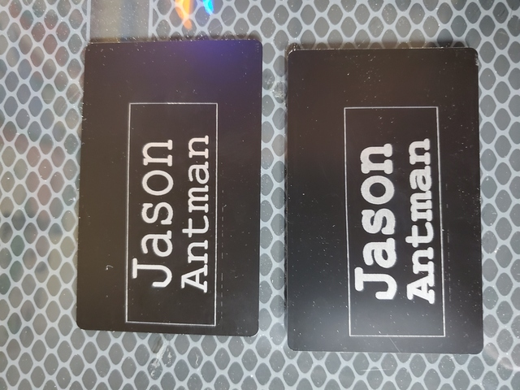
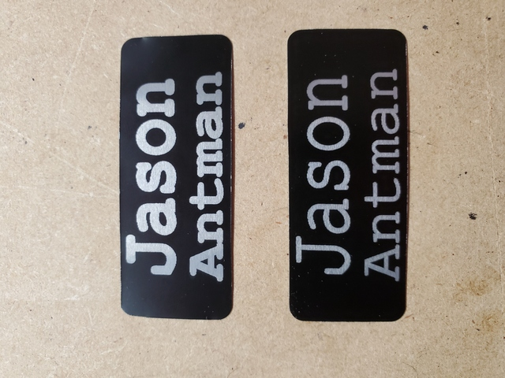

# jantman/glowforge-projects/nametag

My original idea was to make a name tag out of mild steel, that I could just clip to my shirt/whatever with a magnet. Since the GlowForge can't handle steel, I decided to use anodized aluminum instead, glue a magnet to the back, and then stick that to whatever.

I used [these](https://www.amazon.com/gp/product/B07P1DZGLH/) multi-colored 3.3x2.1" (~84x53mm), 0.008" thick (0.22mm) anodized aluminum "business cards" from Amazon, currently $19.99 USD for a pack of 50.

For the "design" such as it is, I laid out the text in Inkscape and then converted it to a path

GlowForge printing settings were based on an Amazon review for the aluminum, and done on an older and very well used GlowForge Pro:

* Custom/unknown material, thickness 0.008".
* Pathed text: engraving unknown material, Speed 1000, Power 100, 340 lines per inch, 1 pass, auto focus.
* Outline/border (used as a cut line): scoring unknown material, Speed 500, Power Full, 1 pass, auto focus.

My first test, [Original-Pathed.svg](Original-Pathed.svg) engraved quite well but was far too large:

Once I knew that the aluminum would at least print nicely, I experimented a bit with size by printing on regular paper and decided on final dimensions of approximately 1x2.5 inches (25x64mm). So I didn't have to worry about squaring up the cards in the GlowForge, I put a square border around the text (at the appropriate dimensions) to act as a cutting guide.

I experimented with using an Olfa PC-L laminate scoring knife to score and then snap the aluminum, but that resulted in a poor quality edge that was rounded and a bit distorted. On a whim I tried cutting the aluminum with a sturdy pair of titanium-coated Westcott utility scissors, and it worked quite well (the edge still isn't perfect, but it looks good enough for me). I trimmed the corners with a 3mm corner radius tool ([Fityle R3 from Amazon](https://www.amazon.com/gp/product/B07MMGBFXV/)) and then ran a black Sharpie over the edges just to cover up the bare aluminum on the sides of the cut and the few places where the black finish had scratched off at the very edge.

My plan is to attach (likely just with CA glue) a small rectangle of thin sheet steel to the back of the aluminum and then use a magnet to hold the name tag to my shirt (or whatever else).
