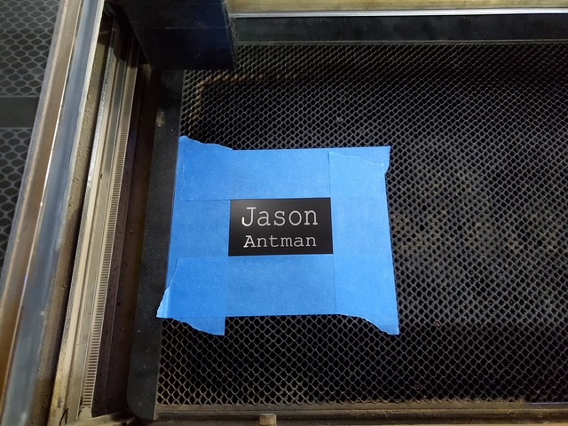
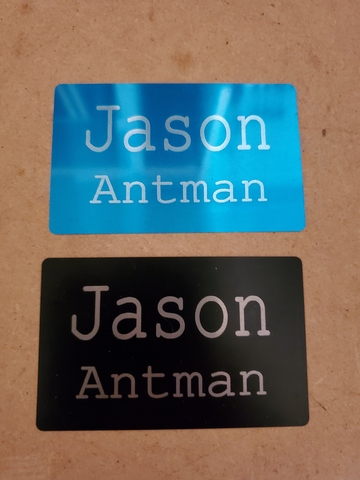

# jantman/glowforge-projects/nametag

My original idea was to make a name tag out of mild steel, that I could just clip to my shirt/whatever with a magnet. Since the GlowForge can't handle steel, I decided to use anodized aluminum instead, glue a magnet to the back, and then stick that to whatever.

I used [these](https://www.amazon.com/gp/product/B07P1DZGLH/) multi-colored 3.3x2.1", 0.008" thick (0.22mm) anodized aluminum "business cards" from Amazon, currently $19.99 for a pack of 50.

For the "design" such as it is, I laid out the text in Inkscape and then converted it to a path

GlowForge printing settings were based on an Amazon review for the aluminum, and done on an older and very well used GlowForge Pro:

* Custom/unknown material, thickness 0.008".
* Pathed text: engraving unknown material, Speed 1000, Power 100, 340 lines per inch, 1 pass, auto focus.
* Outline/border (used as a cut line): scoring unknown material, Speed 500, Power Full, 1 pass, auto focus.

My first test, [Original-Pathed.svg](Original-Pathed.svg) engraved quite well but was far too large:

Once I knew that the aluminum would at least print nicely, I experimented a bit with size by printing on regular paper.
